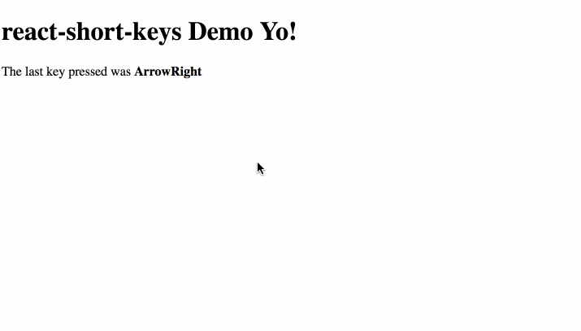

# React Short Keys 🔑

[![npm package][npm-badge]][npm]

A React component that allows you to handle keyboard input and react to keys pressed.
- Zero dependency 0️⃣
- Simple API 👌
- Lightweight (2.53 kB gzipped)  :dove:

# Install

Install via npm or yarn

```
npm i react-short-keys -S
```
or

```
yarn add react-short-keys
```

#Use

Add the KeyPress component where you need to handle a keypress e.g

```
import KeyPress from 'react-short-keys';

class Demo extends Component {

  state = {key: ''};

  setKey = event => this.setState({key: event.key});

  render() {
    const {
      key
    } = this.state;

    return (
        <div>
          <h1>react-short-keys Demo Yo!</h1>
          <KeyPress
              onKeys={[37, 38, 39, 40]}
              onKeyPress={this.setKey}
          />
          <HandleKeyTriggers
              pressedKey={key}
          />
        </div>
      )
  }
}
```

The above example listens for the arrow keys and triggers a function only when an arrow key is triggered.

## Common key codes
Some common key codes are bundled and exported for easy use. 
```
import KeyPress, { ARROW_LEFT, ARROW_RIGHT } from 'react-short-keys';

....

<KeyPress onKeys={[ARROW_LEFT, ARROW_RIGHT]} onKeyPres={() => someAction} />
```



[npm-badge]: https://img.shields.io/npm/v/npm-package.png?style=flat-square
[npm]: https://www.npmjs.org/package/react-short-keys

